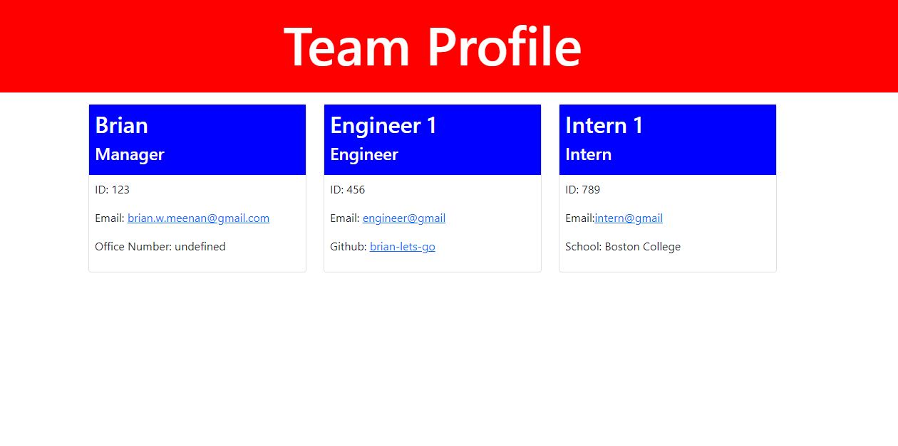

# Team Profile Generator
  
   
  
  ## Table-of-Contents

  * [Description](#description)
  * [Installation](#installation)
  * [Use](#use)
  * [License](#license)
  * [Contributing](#contributing)
  * [Tests](#tests)
  * [Questions](#contact)
  
  ## [Description](#table-of-contents)
  This is a team profile generator that uses jest to test classes for correct functionality. It also uses inquirer to accept data entry via the command line and publish an HTML file that will display the entries.

  Link to Github repo [here](https://github.com/Brian-Lets-Go/team-profile-generator).

  Link to download walkthrough video [here](https://drive.google.com/file/d/1mpqPg-cdzNb8rEWZ_ktQPrUgURuqaSnY/view).

  

  ## [Installation](#table-of-contents)
  When you clone the repository please run npm install to install the jest and inquirer packages

  ## [Use](#table-of-contents)
  Once cloned and installed, please run node index to begin the data entry for a Manager and additonal team members
  
   

  ## [Contributing](#table-of-contents)
  
  Thank you for your interest in this project. However, contributions will not be accepted
    
  
  ## [Tests](#table-of-contents)
  run npm test from the command line in the root of the directory
  
  ## [Questions](#table-of-contents)
  Please contact me using the following links:
  [GitHub](https://github.com/brian-lets-go)
  [Email: brian.w.meenan@gmail.com](mailto:brian.w.meenan@gmail.com)
